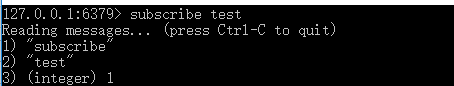

# 集信达【短信平台】项目概述及管理端


## 1. 项目概述

### 1.1 背景介绍

随着企业业务扩张、应用成倍的增加、短信规模化使用，传统短信平台的接入方式和单一的信息发送功能，已经不能完全满足现代企业管理的需求，所以统一入口、减少对接成本、同时兼顾多种短信业务、简单易行的操作与维护、高稳定、高可靠的移动信息化应用成为短信平台发展趋势。  

 

- 服务越来越多，每个服务都有可能发送短信，是否每个服务都需要对接一遍？
- 多应用对接短信，如何做到短信发送服务高效、稳定？
- 短信通道出现异常时，如何快速切换通道？
- 切换通道时，如何做到应用服务无感知？
-  如何统计各服务短信发送情况，以便进行后续营销分析？

本项目（集信达短信平台）的核心在于保证短信高效、准确的送达、简单易操作的对接方式。通过对服务的解耦、通讯方式的升级来提升系统的吞吐量。同时在多通道的加持下，通过智能动态的通道评级、选举、降级、热插拔，增强了系统的健壮性，摆脱对单一通道的依赖。并且提供多种对接方式，满足企业内部的各种需求。

集信达短信平台的整体架构如下：


### 1.2 业务架构

 

### 1.3 技术架构

#### 1.3.1 系统管理服务


#### 1.3.2 短信接收服务
 

#### 1.3.3 短信发送服务
 

### 1.4 项目模块介绍

集信达短信平台，项目整体工程结构和模块功能如下：

```
pd-sms-backend			 # 集信达 短信平台父工程
	├── pd-sms-entity		 # 短信平台实体
	├── pd-sms-manage		 # 系统管理服务
	├── pa-sms-api			 # 短信接收服务，应用系统调用接口、发送短信
	├── pd-sms-server		 # 短信发送服务，调用短信通道、发送短信
	└── pd-sms-sdk			 # 短信SDK，应用系统引入、发送短信
```

集信达短信服务有三个：后台管理服务，短信接收服务，短信发送服务：

| 应用          | 端口 | 说明         | 启动命令                      |
| ------------- | ---- | ------------ | ----------------------------- |
| pd-sms-manage | 8770 | 后台管理服务 | java -jar pd-sms-manage.jar & |
| pd-sms-api    | 8771 | 短信接收服务 | java -jar pd-sms-api.jar &    |
| pd-sms-server | 8772 | 短信发送服务 | java -jar pd-sms-server.jar & |

## 2. 项目环境准备

### 2.1 环境要求

- JDK ： 1.8 +
- Maven： 3.3 +
  http://maven.apache.org/download.cgi
- Docker: 18 +

  docker-compose: 1.23  +
- Mysql： 5.7.0 +
  https://downloads.mysql.com/archives/community
- Redis： 4.0 +
  https://redis.io/downloa
- Nacos： 1.1.4
  https://github.com/alibaba/nacos/releases
- Node： 11.3+（集成npm）
  https://nodejs.org/en/download

### 2.2 Redis集群（自学）
Redis集群的哨兵模式是一种特殊的模式，首先Redis提供了哨兵的命令，哨兵是一个独立的进程，作为进程，它会独立运行。其原理是哨兵通过发送命令，等待Redis服务器响应，从而监控运行的多个Redis实例。
哨兵模式作用：

 - 通过发送命令，让Redis服务器返回监控其运行状态，包括主服务器和从服务器。
 - 当哨兵监测到master宕机，会自动将slave切换成master，然后通过发布订阅模式通知其他的从服务器，修改配置文件，让它们切换主机。

 

除了监控Redis服务之外，哨兵之间也会互相监控。本文采用一主、双从、三哨兵方式

 

部署方式为：docker compose：

第一步：创建redis docker-compose.yml配置文件 目录,并复制docs/dockerfile/redis/docker-compose.yml 到当前目录，配置文件可根据需要调整

~~~ docker-compose.yml
version: '3.4'
services:
  master:
    image: redis
    container_name: redis-master
    restart: always
    command: redis-server --port 16380 --requirepass 123456   # 16380 是定义的主库端口，默认:6379;  --requirepass 123456 是redis密码。
    ports:
      - 16380:16380   # 将容器的16380端口映射到宿主机的16380端口上,第一个16380为宿主机端口。

  slave1:
    image: redis
    container_name: redis-slave-1
    restart: always
    command: redis-server --slaveof 127.0.0.1 16380 --port 16381 --requirepass 123456 --masterauth 123456   # 127.0.0.1 16380 为主库ip和端口（此处我们使用宿主机的ip和主库映射出来的端口）；16381 是定义的从库端口，默认:6379;  --requirepass 123456 是redis密码； --masterauth 123456 是主库的密码。
    ports:
      - 16381:16381


  slave2:
    image: redis
    container_name: redis-slave-2
    restart: always
    command: redis-server --slaveof 127.0.0.1 16380 --port 16382 --requirepass 123456 --masterauth 123456   # 127.0.0.1 16380 为主库ip和端口（此处我们使用宿主机的ip和主库映射出来的端口）；16382 是定义的从库端口，默认:6379;  --requirepass 123456 是redis密码； --masterauth 123456 是主库的密码。
    ports:
      - 16382:16382
~~~

第二步：执行启动命令
在当前目录下执行启动命令

~~~
docker-compose -f docker-compose.yml up -d
~~~


第三步：创建sentinel docker-compose.yml配置文件 目录,并复制配置文件
复制 docs/dockerfile/sentinel/docker-compose.yml 到当前目录
复制 docs/dockerfile/sentinel/sentinel1.conf 到当前目录
复制 docs/dockerfile/sentinel/sentinel2.conf 到当前目录
复制 docs/dockerfile/sentinel/sentinel3.conf 到当前目录
docker-compose.yml

~~~
version: '3.4'
services:
  sentinel1:
    image: redis
    container_name: redis-sentinel-1
    command: redis-sentinel /home/ec2-user/dockerfile/sentinel/sentinel.conf # 自定义路径，可更改，但是需要和volumes中的路径相同。
    restart: always
    ports:
      - 26380:26380
    volumes:
      - ./sentinel1.conf:/home/ec2-user/dockerfile/sentinel/sentinel.conf # 自定义路径，可更改，但是需要和command中的路径相同。

  sentinel2:
    image: redis
    container_name: redis-sentinel-2
    command: redis-sentinel /home/ec2-user/dockerfile/sentinel/sentine2.conf
    restart: always
    ports:
      - 26381:26381
    volumes:
      - ./sentinel2.conf:/home/ec2-user/dockerfile/sentinel/sentine2.conf

  sentinel3:
    image: redis
    container_name: redis-sentinel-3
    command: redis-sentinel /home/ec2-user/dockerfile/sentinel/sentine3.conf
    restart: always
    ports:
      - 26382:26382
    volumes:
      - ./sentinel3.conf:/home/ec2-user/dockerfile/sentinel/sentine3.conf
~~~
sentinel1.conf
~~~
port 26380
daemonize no
pidfile /var/run/redis-sentinel.pid
dir /tmp
sentinel monitor mymaster 127.0.0.1 16380 2  # 主机 ip 与 端口；2表示当有两个sentinel认为主机失效时才会执行切换
sentinel auth-pass mymaster 123456 # 主机密码
sentinel down-after-milliseconds mymaster 30000
sentinel parallel-syncs mymaster 1
sentinel failover-timeout mymaster 180000
sentinel deny-scripts-reconfig yes
~~~
sentinel2.conf
~~~
port 26381
daemonize no
pidfile /var/run/redis-sentinel.pid
dir /tmp
sentinel monitor mymaster 127.0.0.1 16380 2  # 主机 ip 与 端口；2表示当有两个sentinel认为主机失效时才会执行切换
sentinel auth-pass mymaster 123456 # 主机密码
sentinel down-after-milliseconds mymaster 30000
sentinel parallel-syncs mymaster 1
sentinel failover-timeout mymaster 180000
sentinel deny-scripts-reconfig yes
~~~
sentinel3.conf
~~~
port 26382
daemonize no
pidfile /var/run/redis-sentinel.pid
dir /tmp
sentinel monitor mymaster 127.0.0.1 16380 2  # 主机 ip 与 端口；2表示当有两个sentinel认为主机失效时才会执行切换
sentinel auth-pass mymaster 123456 # 主机密码
sentinel down-after-milliseconds mymaster 30000
sentinel parallel-syncs mymaster 1
sentinel failover-timeout mymaster 180000
sentinel deny-scripts-reconfig yes
~~~

第四步：执行启动命令
在当前目录下执行启动命令

~~~
docker-compose -f docker-compose.yml up -d
~~~


### 2.3 后端工程导入 

将资料中的初始工程导入开发工具，如下：

   

### 2.4 数据库

数据库脚本位于导入的初始工程`/docs/mysql/pd-sms.sql`，创建pd_sms数据库并执行pd-sms.sql脚本文件完成建表操作。创建完成后可以看到如下表：


### 2.5 前端工程

前端工程采用vue2 + ts + spa架构，前端工程在资料中已经提供，位置为：`/资料/前端工程`

1. 前端代码结构和核心代码

    

2. 编译、运行前端代码

   ```javascript
   npm install -g cnpm --registry=https://registry.npm.taobao.org
   cnpm install
   cnpm run serve
   ```

## 3. 后台管理服务

 

### 3.1. 项目结构

#### 3.1.1 基础工程

基础工程为pd-sms-entity工程，主要是一些实体类、DTO、工具类、Mapper接口等，作为基础模块，其他几个服务都会依赖此基础模块。

 

#### 3.1.2 管理端工程

pd-sms-manage作为后台管理服务的maven工程，主要功能是对基础数据进行维护操作，例如签名管理、模板管理、通道管理、通道优先级配置、数据统计等。

 

### 3.2. 功能清单

下图展示了后台管理服务实现的功能清单：

 

### 3.3. 数据模型与类

| 序号 | 表名             | 类名                  | 说明               |
| ---- | ---------------- | --------------------- | ------------------ |
| 1    | signature        | SignatureEntity       | 短信签名           |
| 2    | template         | TemplateEntity        | 短信模板           |
| 3    | config           | ConfigEntity          | 短信通道配置       |
| 4    | config_signature | ConfigSignatureEntity | 通道与签名关系     |
| 5    | config_template  | ConfigTemplateEntity  | 通道与模板关系     |
| 6    | platform         | PlatformEntity        | 接入平台(应用管理) |
| 7    | receive_log      | ReceiveLogEntity      | 短信接收日志       |
| 8    | manual_process   | ManualProcessEntity   | 人工处理任务       |
| 9    | send_log         | SendLogEntity         | 短信发送日志       |
| 10   | black_list       | BlackListEntity       | 黑名单             |
| 11   | timing_push      | TimingPushEntity      | 定时发送           |

名词解释：

- 短信签名：是指主叫用户在发送短信过程中，附加主叫用户的个性化签名，发送到被叫手机用户的业务。


- 短信模板：即具体发送的短信内容，短信模版通常可以支持验证码、通知、推广三种短信类型。

举例：您的验证码为【变量】，打死不告诉别人！

- 短信通道：指第三方短信平台，例如阿里云短信、乐信短信、梦网短信等。

### 3.4. 基础属性自动注入

**功能**：通过自定义注解和切面，在进行数据维护时实现实体中基础属性的自动赋值（创建者、创建时间、修改者、修改者）。

#### 3.4.1 基础属性

基础实体类，业务实体类的基类：

```
package com.itheima.pinda.entity.base;

import com.baomidou.mybatisplus.annotation.TableId;
import io.swagger.annotations.ApiModelProperty;
import lombok.Data;
import java.io.Serializable;
import java.time.LocalDateTime;

/**
 * 基础实体类，所有实体都需要继承
 */
@Data
public abstract class BaseEntity implements Serializable {
    @TableId
    @ApiModelProperty(value = "主键")
    private String id;

    @ApiModelProperty(value = "创建时间")
    private LocalDateTime createTime;

    @ApiModelProperty(value = "创建人")
    private String createUser;

    @ApiModelProperty(value = "修改时间")
    private LocalDateTime updateTime;

    @ApiModelProperty(value = "修改人")
    private String updateUser;

    @ApiModelProperty(value = "逻辑删除：0删除")
    private Integer isDelete;

}
```

#### 3.4.2 自定义注解

```
@Documented
@Retention(RetentionPolicy.RUNTIME)
@Target(ElementType.METHOD)
public @interface DefaultParams {
}
```

#### 3.4.3 定义切面类

```
/**
 * 通过切面方式，自定义注解，实现实体基础数据的注入（创建者、创建时间、修改者、修改时间）
 */
@Component
@Aspect
@Slf4j
public class DefaultParamsAspect {
    @SneakyThrows
    @Before("@annotation(com.itheima.sms.annotation.DefaultParams)")
    public void beforeEvent(JoinPoint point) {
        //从threadlocal中获取用户id
        Long userId = BaseContextHandler.getUserId();
        if (userId == null) {
            userId = 0L;
        }
        Object[] args = point.getArgs();
        for (int i = 0; i < args.length; i++) {
            Class<?> classes = args[i].getClass();
            Object id = null;
            Method method = getMethod(classes, "getId");
            if (null != method) {
                id = method.invoke(args[i]);
            }

            //请求操作的对象的id为空时，为创建操作
            if (null == id) {
                method = getMethod(classes, "setCreateUser", String.class);
                if (null != method) {
                    method.invoke(args[i], userId.toString());
                }
                method = getMethod(classes, "setCreateTime", LocalDateTime.class);
                if (null != method) {
                    method.invoke(args[i], LocalDateTime.now());
                }
            }

            //新建修改更新
            method = getMethod(classes, "setUpdateUser", String.class);
            if (null != method) {
                method.invoke(args[i], userId.toString());
            }
            method = getMethod(classes, "setUpdateTime", LocalDateTime.class);
            if (null != method) {
                method.invoke(args[i], LocalDateTime.now());
            }
        }
    }

    private Method getMethod(Class classes, String name, Class... types) {
        try {
            return classes.getMethod(name, types);
        } catch (NoSuchMethodException e) {
            return null;
        }
    }
}
```

#### 3.4.4 使用注解

在Controller方法上添加注解，保存基础属性。

```java
@PostMapping
@ApiOperation("保存")
@DefaultParams
public R save(@RequestBody ObjectEntity entity) {
	//具体实现逻辑...
	return R.success();
}
```

### 3.5. Redis发布订阅模式

Redis 发布订阅 (pub/sub) 是一种消息通信模式：发送者 (pub) 发送消息，订阅者 (sub) 接收消息。Redis 客户端可以订阅任意数量的频道。

Redis的发布订阅模式本质和传统的MQ的发布订阅类似，但是相对于其它几款MQ产品来说，redis的使用更加便捷，也更加轻量化，不需要单独去搭建集成一套繁重的MQ框架。但缺点也很明显，redis发布的消息不会持久化，所以当某一台服务器出现问题的时候，这个消息会丢失，所以在考虑使用之前要慎重，当前的业务是否对数据一致性要求很高，如果要求很高，还是建议使用MQ产品。

在发布者订阅者模式下，发布者将消息发布到指定的 channel 里面， 凡是监听该 channel 的消费者都会收到同样的一份消息，这种模式类似于是收音机模式，即凡是收听某个频道的听众都会收到主持人发布的相同的消息内容。  此模式常用于群聊天、 群通知、群公告等场景。

发布订阅模式下的几个概念：

- Publisher： 发布者
- Subscriber：订阅者
- Channel： 频道  

下图展示了频道 channel1 ， 以及订阅这个频道的三个客户端 —— client1、 client2 和 client3 之间的关系： 


当有新消息通过 PUBLISH 命令发送给频道 channel1 时， 这个消息就会被发送给订阅它的三个客户端：


#### 3.5.1 案例演示

1.首先在本地启动redis服务

  

2.启动4个客户端 redis-cli

3.将其中三个客户端设置监听频道 test

```
subscribe test
```

 

 4.将第四个客户端作为消息发布的客户端，向频道 test 发布消息

 

可以看到另外三个客户端都收到了消息

 

#### 3.5.2 代码案例

1、导入spring-boot-starter-data-redis依赖

~~~xml
<dependency>
    <groupId>org.springframework.boot</groupId>
    <artifactId>spring-boot-starter-data-redis</artifactId>
</dependency>
~~~

2、编写消息监听器，作为消息的订阅者

```
package com.itheima.sms.listener;

import lombok.extern.slf4j.Slf4j;
import org.springframework.data.redis.connection.Message;
import org.springframework.data.redis.connection.MessageListener;
import org.springframework.stereotype.Component;

/**
 * 消息监听器
 */
@Component
@Slf4j
public class MyListener implements MessageListener {

    @Override
    public void onMessage(Message message, byte[] pattern) {

        log.info("收到消息：{}", message);

    }
}
```

3、编写订阅发布模式的容器配置

```
package com.itheima.sms.config;

import org.springframework.beans.factory.annotation.Autowired;
import org.springframework.boot.autoconfigure.AutoConfigureAfter;
import org.springframework.context.annotation.Bean;
import org.springframework.context.annotation.Configuration;
import org.springframework.data.redis.connection.RedisConnectionFactory;
import org.springframework.data.redis.listener.PatternTopic;
import org.springframework.data.redis.listener.RedisMessageListenerContainer;
import org.springframework.data.redis.listener.adapter.MessageListenerAdapter;

/**
 * 订阅发布模式的容器配置
 */
@Configuration
@AutoConfigureAfter({MyListener.class})
public class SubscriberConfig {

    @Autowired
    private MyListener myListener;

    /**
     * 创建消息监听容器
     *
     * @param redisConnectionFactory
     * @return
     */
    @Bean
    public RedisMessageListenerContainer getRedisMessageListenerContainer(RedisConnectionFactory redisConnectionFactory) {
        RedisMessageListenerContainer redisMessageListenerContainer = new RedisMessageListenerContainer();
        redisMessageListenerContainer.setConnectionFactory(redisConnectionFactory);

        //可以添加多个监听订阅频道
        //当前监听的是通道：MYTOPIC
        redisMessageListenerContainer.addMessageListener(new MessageListenerAdapter(myListener), new PatternTopic("MYTOPIC"));

        return redisMessageListenerContainer;
    }
}
```

4、编写消息发布者

- 通过redis客户端发送消息


- 通过Java代码发送消息

```java
package com.itheima.test;

import com.itheima.sms.SmsManageApplication;
import org.junit.Test;
import org.junit.runner.RunWith;
import org.springframework.beans.factory.annotation.Autowired;
import org.springframework.boot.test.context.SpringBootTest;
import org.springframework.data.redis.core.RedisTemplate;
import org.springframework.test.context.junit4.SpringRunner;

@RunWith(SpringRunner.class)
@SpringBootTest(classes = SmsManageApplication.class)
public class RedisTest {
    @Autowired
    private RedisTemplate redisTemplate;

    @Test
    public void test1(){
        for (int i = 0; i < 10; i++) {
            redisTemplate.convertAndSend("MYTOPIC","this is a message ");
        }
    }
}
```

### 3.6. 通道管理

#### 3.6.1 产品原型

 

 

#### 3.6.2 需求分析

- 通道信息增、删、改、查（分页、详情）
- 通道排序：通过拖动对前端通道进行排序
- 关联通道与短信签名：一个通道可以有多个签名
- 关联通道与短信模板：一个通道可以有多个模板
- 通道优先级排序后通知短信发送服务，更新缓存中的通道优先级

#### 3.6.3 具体实现

管理端服务有一个场景使用了redis的发布订阅模式：短信通道的优先级发生变化（如人工设置）后，通过redis发布订阅模式通知短信发送服务，短信发送服务接收到消息后自动调整短信发送时使用的通道的优先级（短信发送服务缓存了短信通道的配置信息）。

基础代码都已经实现，此处只需要实现通道排序后通知短信发送服务的代码即可。也就是ConfigServiceImpl类的sendUpdateMessage方法。

短信发送服务业务逻辑说明：

1、为了保证短信发送服务的可用性，在短信发送服务启动时会自动生成当前服务实例的一个uuid作为服务标识保存到redis中，并且每隔3分钟上报服务信息证明服务状态正常

2、短信发送服务启动后会每隔10分钟检查redis中的服务上报信息，如果某个实例超过5分钟没有上报则认为此服务下线，就会从redis中将此服务实例信息删除

3、短信发送服务在启动时会从数据库中查询出可用通道列表并按照优先级排序，然后缓存到redis中

~~~java
//发送消息，通知短信发送服务更新缓存中的通道优先级
public void sendUpdateMessage() {
    //获得所有注册到redis中的短信发送服务实例
    Map map = redisTemplate.opsForHash().entries("SERVER_ID_HASH");
    log.info("全部服务：{}", map);
    Long current = System.currentTimeMillis();

    for (Object key : map.keySet()) {
        long valueLong = Long.parseLong(map.get(key).toString());
        
        //五分钟内报告，说明短信发送服务状态正常
        if (current - valueLong < (1000 * 60 * 5)) {
            //删除redis中缓存的可用通道，因为通道优先级发生变化，redis中缓存的可用通道需要重新加载
            redisTemplate.delete("listForConnect");
            
            //发布消息
            redisTemplate.convertAndSend("TOPIC_HIGH_SERVER",
                                         ServerTopic
                                         .builder()
                                         .option(ServerTopic.INIT_CONNECT)
                                         .value(key.toString())
                                         .build()
                                         .toString()
                                        );
            log.info("发送消息通知短信发送服务重新构建通道");
            return;
        }
    }
}
~~~
