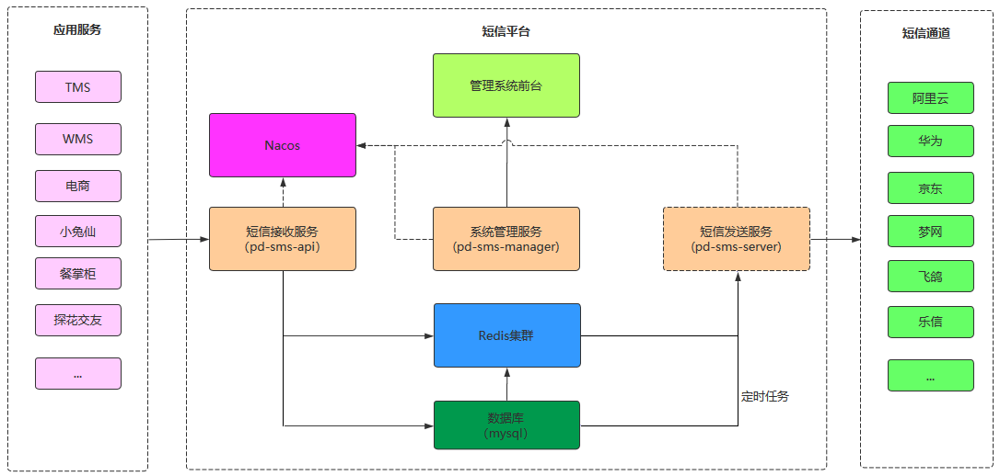

# 集信达【短信平台】短信接收服务

## 1. 短信接收服务介绍

短信接收服务的作用就是为应用提供访问接口，应用需要发送短信时只需要调用短信接收服务，由短信接收服务将信息保存到消息缓冲区（Mysql、Redis）。后续会由短信发送服务从消息缓冲区获取消息并发送短信。

集信达短信平台整体架构：



集信达短信平台业务架构： 


通过上面的业务架构可以看到，短信接收服务（pd-sms-api）提供3种方式供业务系统调用：

- HTTP接口
- TCP
- SDK形式

短信接收服务通过资质验证（可开关）、短信内容校验后将短信信息发送到对应中间件中（Redis、MySQL）。

短信发送方式分为两种类型：

1、定时发送短信：将短信内容存储到MySQL数据库中，由短信发送服务通过定时任务获取并发送
2、普通短信：将短信内容推送到Redis队列中，由短信发送服务异步接收并发送

## 2. Redis队列

### 2.1 Redis队列介绍

Redis支持五种数据类型：string（字符串），hash（哈希），list（列表），set（集合）及zset(sorted set：有序集合)。

Redis的list是简单的字符串列表，按照插入顺序排序。可以添加一个元素到列表的头部（左边）或者尾部（右边）。

使用Redis的list可以模拟消息队列，即使用**rpush**和**lpush**命令将数据插入队列（生产消息），使用**lpop**和**rpop**命令将数据弹出队列（消费消息）。

队列中的消息可以由不同的生产者写入，也可以由不同的消费者消费，但是一个消息一定是只能被消费一次。

### 2.2 案例演示

发布消息：

```ruby
root@77889f10b0c8:/data# redis-cli
127.0.0.1:6379> LPUSH channel1 msg1
(integer) 1
127.0.0.1:6379> LPUSH channel1 msg2
(integer) 2
127.0.0.1:6379> LPUSH channel1 msg3
(integer) 3
127.0.0.1:6379> LPUSH channel1 msg4
(integer) 4
127.0.0.1:6379> LPUSH channel1 msg5
(integer) 5
```

查看消息：

```ruby
127.0.0.1:6379> LRANGE channel1 0 -1
1) "msg5"
2) "msg4"
3) "msg3"
4) "msg2"
5) "msg1"
```

消费消息：

```ruby
127.0.0.1:6379> RPOP channel1
"msg1"
127.0.0.1:6379> RPOP channel1
"msg2"
127.0.0.1:6379> LRANGE channel1 0 -1
1) "msg5"
2) "msg4"
3) "msg3"
127.0.0.1:6379> RPOP channel1
"msg3"
127.0.0.1:6379> RPOP channel1
"msg4"
127.0.0.1:6379> RPOP channel1
"msg5"
127.0.0.1:6379> RPOP channel1
(nil)
127.0.0.1:6379> LRANGE channel1 0 -1
(empty list or set)
127.0.0.1:6379> 
```

RPOP命令不具有阻塞功能，如果需要阻塞功能可以使用BRPOP命令。

### 2.3 代码案例

~~~java
package com.itheima.test;

import com.itheima.sms.SmsApiApplication;
import org.junit.Test;
import org.junit.runner.RunWith;
import org.springframework.beans.factory.annotation.Autowired;
import org.springframework.boot.test.context.SpringBootTest;
import org.springframework.data.redis.core.RedisTemplate;
import org.springframework.test.context.junit4.SpringRunner;

@RunWith(SpringRunner.class)
@SpringBootTest(classes = SmsApiApplication.class)
public class RedisListTest {
    @Autowired
    private RedisTemplate redisTemplate;

    //生产消息
    @Test
    public void testPush(){
        for (int i = 0; i < 10; i++) {
            redisTemplate.opsForList().leftPush("itcast","msg" + i);
        }
    }
	
    //消费消息
    @Test
    public void testPop(){
        for (int i = 0; i < 11; i++) {
            Object itcast = redisTemplate.opsForList().rightPop("itcast");
            System.out.println("消费消息："+itcast);
        }
    }

}
~~~

## 3. 短信接收服务

### 3.1 需求分析

**功能需求：**

- 应用系统调用短信接收服务提供的接口，由短信接收服务将信息保存到消息缓冲区（Mysql、Redis）
- 调用方式：HTTP、TCP、SDK

**处理流程：**

短信接收服务接收到应用系统请求后，会进行相关的校验处理，校验通过则将信息保存到消息缓存区，具体处理流程如下：


### 3.2 项目结构


### 3.3 数据模型与类

| 序号 | 表名             | 类名                  | 说明               |
| ---- | ---------------- | --------------------- | ------------------ |
| 1    | signature        | SignatureEntity       | 短信签名           |
| 2    | template         | TemplateEntity        | 短信模板           |
| 3    | config           | ConfigEntity          | 短信通道配置       |
| 4    | config_signature | ConfigSignatureEntity | 通道与签名关系     |
| 5    | config_template  | ConfigTemplateEntity  | 通道与模板关系     |
| 6    | platform         | PlatformEntity        | 接入平台(应用管理) |
| 7    | receive_log      | ReceiveLogEntity      | 短信接收日志       |
| 8    | black_list       | BlackListEntity       | 黑名单             |
| 9    | timing_push      | TimingPushEntity      | 定时发送           |

注意：此处只是列出和短信接收服务有关的数据模型和类。

### 3.4 消息存储

导入的初始工程中已经实现了大部分代码，主要逻辑为通过Controller提供HTTP接口服务接收应用系统请求，然后调用Service，在Service中进行一系列校验，如果校验通过则需要将消息保存到消息缓冲区。

**将消息保存到消息缓冲区的业务逻辑为：**

1、进行短信分类，分为实时发送短信和定时发送短信

2、如果是定时发送短信则将消息保存到Mysql数据库

3、如果是实时发送短信则将消息保存到Redis队列，判断短信模板类型，如果是验证码类型则将消息保存到高优先级队列TOPIC_HIGH_SMS，如果是其他类型则将消息保存到普通队列TOPIC_GENERAL_SMS

4、保存短信接收日志到Mysql数据库

**具体实现代码如下（SmsSendServiceImpl类的pushSmsMessage方法）：**

~~~java
/**
* 将消息保存到消息缓冲区
*
* @param templateEntity
* @param smsSendDTO
* @param platformEntity
*/
private void pushSmsMessage(TemplateEntity templateEntity, 
                            SmsSendDTO smsSendDTO, PlatformEntity platformEntity) {
        // TODO 短信发送服务：将短信信息保存到数据库或者Redis队列
        ReceiveLogEntity entity = new ReceiveLogEntity();
        entity.setApiLogId(UUID.randomUUID().toString().toUpperCase());
        Long start = System.currentTimeMillis();
        try {
            // 设置日志id
            smsSendDTO.setLogId(entity.getApiLogId());
            String smsJson = JSON.toJSONString(smsSendDTO);
            if (StringUtils.isNotEmpty(smsSendDTO.getSendTime())) {
                // 定时发送，存入mysql数据库
                TimingPushEntity timingPushEntity = new TimingPushEntity();
                timingPushEntity.setMobile(smsSendDTO.getMobile());
                timingPushEntity.setTemplate(smsSendDTO.getTemplate());
                timingPushEntity.setSignature(smsSendDTO.getSignature());
                timingPushEntity.setTiming(smsSendDTO.getSendTime());
                timingPushEntity.setRequest(JSON.toJSONString(smsSendDTO));

                timingPushService.save(timingPushEntity);
            } else {
                // 实时发送，存入redis队列
                if (templateEntity.getType() == TemplateType.VERIFICATION.getCode()) {
                    // 验证码类型 单独队列 优先级高
                    redisTemplate.opsForList().leftPush("TOPIC_HIGH_SMS", smsJson);
                    log.info("TOPIC_HIGH_SMS:{}", smsJson);
                } else {
                    // 营销类 单独队列 优先级不高
                    redisTemplate.opsForList().leftPush("TOPIC_GENERAL_SMS", smsJson);
                    log.info("TOPIC_GENERAL_SMS:{}", smsJson);
                }
            }
            entity.setStatus(1);
        } catch (Exception e) {
            log.error("发送短息异常", e);
            entity.setStatus(0);
            entity.setError(ExceptionUtils.getErrorStackTrace(e));
        } finally {
            entity.setPlatformId(platformEntity.getId());
            entity.setPlatformName(platformEntity.getName());
            entity.setConfigIds(StringUtils.join(smsSendDTO.getConfigIds(), ","));
            entity.setTemplate(smsSendDTO.getTemplate());
            entity.setSignature(smsSendDTO.getSignature());
            entity.setMobile(smsSendDTO.getMobile());
            entity.setRequest(JSON.toJSONString(smsSendDTO.getParams()));
            entity.setUseTime(System.currentTimeMillis() - start);
            entity.setBusiness(smsSendDTO.getBatchCode());
			
            //保存短信接收日志
            receiveLogMapper.insert(entity);
        }
}
~~~

### 3.5 TCP接口

基于Netty进行网络编程，为短信接收服务提供TCP接口，应用系统可以通过TCP调用此接口来和短信接收服务对接。

涉及到的类：


- Netty服务启动类：用于启动Netty服务

- 通道初始化器：主要目的是为程序员提供一个简单的工具，用于在某个Channel注册到EventLoop后，对这个Channel执行一些初始化操作，例如可以添加用户自定义的服务端处理器

- 服务端处理器：具体执行处理逻辑，例如读取消息

导入的初始工程中主体代码已经完成，只需要实现服务端处理器的具体处理逻辑即可（NettyServerHandler的channelRead0方法）：

~~~java
@Override
protected void channelRead0(ChannelHandlerContext ctx, String msg) {
    log.info("接收请求开始：======= 接收报文：" + msg);

    String respMsg = "success";
    try {
        //解析报文
        SmsParamsDTO smsParamsDTO = parseMessage(msg);
        if (null == smsParamsDTO) {
            log.info("报文解析失败");
            return;
        }
        //调用Service将消息保存到消息缓冲区
        SpringUtils.getBean(SmsSendServiceImpl.class).send(smsParamsDTO);
    } catch (Exception e) {
        respMsg = e.getMessage();
    }
    
    log.info("返回报文 ========== " + respMsg);
    ctx.writeAndFlush(respMsg + "\n");//这个地方必须加上"\n"，不然客户端接收不到消息
}
~~~

可以使用telnet作为Netty客户端来测试Netty服务，报文如下：

~~~json
{"accessKeyId": "7fea0419ea7c435887f996cfecda5a3a","mobile": "13812345678","params": {"code":"123456"},"signature": "DXQM_000000001","template": "DXMB_000000001","timestamp": "","sendTime":"2020-12-31 10:00"}
~~~

### 3.6 SDK

#### 3.6.1 说明

SDK 是 Software Development Kit 的缩写，即软件开发工具包。SDK被开发出来是为了减少程序员工作量的，比如公司开发出某种软件的某一功能，把它封装成SDK，提供给其他公司和个人使用。

本小节需要开发短信接收服务SDK，通过SDK可以使应用系统更加方便的调用短信接收服务。

通过SDK方式调用短信接收服务，本质上还是调用的短信接收服务提供的HTTP接口（Controller），只不过是调用的过程在SDK中进行了封装。

项目结构：


#### 3.6.2 实现

导入的初始工程中主体代码已经完成，只需要实现业务处理类的具体逻辑即可（SmsSendServiceImpl的send方法）：

~~~java
/**
* 通过HttpClient发送post请求，请求短信接收服务HTTP接口
* @param baseParamsDTO
* @param url
* @return
*/
private R send(BaseParamsDTO baseParamsDTO,String url){
    //设置accessKeyId
    baseParamsDTO.setAccessKeyId(accessKeyId);
    if (auth) {
        if (StringUtils.isBlank(accessKeyId) || StringUtils.isBlank(accessKeySecret)) {
            R.fail("accessKey 不能为空");
        }
        baseParamsDTO.setTimestamp(String.valueOf(System.currentTimeMillis()));
        baseParamsDTO.setEncryption(SmsEncryptionUtils.encode(baseParamsDTO.getEncryption(), baseParamsDTO.getAccessKeyId(), accessKeySecret));
    }

    if (StringUtils.isBlank(domain)) {
        R.fail("domain 不能为空");
    }
    //HTTP客户端
    CloseableHttpClient httpclient = HttpClients.createDefault();
    //Post请求对象
    HttpPost post = new HttpPost(url);
    //设置请求头
    post.setHeader("Content-Type", "application/json; charset=UTF-8");
    //构造请求体
    StringEntity stringEntity = new StringEntity(JSON.toJSONString(baseParamsDTO), "UTF-8");
    //设置请求体
    post.setEntity(stringEntity);

    try {
        //发送请求
        CloseableHttpResponse response = httpclient.execute(post);
        //获得响应信息
        HttpEntity entity = response.getEntity();
        //解析响应状态码
        if (200 == response.getStatusLine().getStatusCode()) {
            log.info("httpRequest access success, StatusCode is:{}", response.getStatusLine()
                     .getStatusCode());
            String responseContent = EntityUtils.toString(entity);
            log.info("responseContent is :" + responseContent);
            return JSON.parseObject(responseContent, R.class);
        } else {
            log.error("httpRequest access fail ,StatusCode is:{}", response.getStatusLine().getStatusCode());
            return R.fail("status is " + response.getStatusLine().getStatusCode());
        }
    } catch (Exception e) {
        log.error("error :", e);
        return R.fail(e.getMessage());
    } finally {
        post.releaseConnection();
    }
}
~~~

SDK开发完成后，为了方便其他应用使用，通常会将SDK打成jar包上传到远程maven仓库，在应用系统中直接通过maven坐标导入SDK即可使用。

如下是将SDK上传到Nexus后的效果：


#### 3.6.3 测试

第一步：引入SDK的maven坐标

~~~xml
<dependency>
    <groupId>com.itheima</groupId>
    <artifactId>pd-sms-sdk</artifactId>
    <version>1.0.0</version>
</dependency>
~~~

第二步：编写配置文件

~~~yaml
# 服务端使用sdk配置信息
itheima:
  sms:
    auth: false
    domain: http://localhost:8771
    accessKeyId: 7fea0419ea7c435887f996cfecda5a3a
    accessKeySecret: 842ce103df7b4117bb47c888cc528516
~~~

第三步：编写单元测试

~~~java
package com.itheima.test;

import com.itheima.sms.SmsManageApplication;
import com.itheima.sms.sms.dto.SmsParamsDTO;
import com.itheima.sms.sms.service.SmsSendService;
import org.junit.Test;
import org.junit.runner.RunWith;
import org.springframework.beans.factory.annotation.Autowired;
import org.springframework.boot.test.context.SpringBootTest;
import org.springframework.test.context.junit4.SpringRunner;
import java.util.HashMap;
import java.util.Map;

@RunWith(SpringRunner.class)
@SpringBootTest(classes = SmsManageApplication.class)
public class SdkTest {
    @Autowired
    private SmsSendService smsSendService;

    /**
     * 通过SDK方式调用短信接收服务
     */
    @Test
    public void testSend(){
        SmsParamsDTO dto = new SmsParamsDTO();

        dto.setMobile("13812345678");
        dto.setSignature("DXQM_000000001");
        dto.setTemplate("DXMB_000000001");
        Map<String, String> map = new HashMap<>();
        map.put("code","1234");
        dto.setParams(map);
        dto.setSendTime("2020-12-18 10:00");
        dto.setTimestamp(System.currentTimeMillis() +"");
        
        smsSendService.sendSms(dto);
    }
}
~~~


