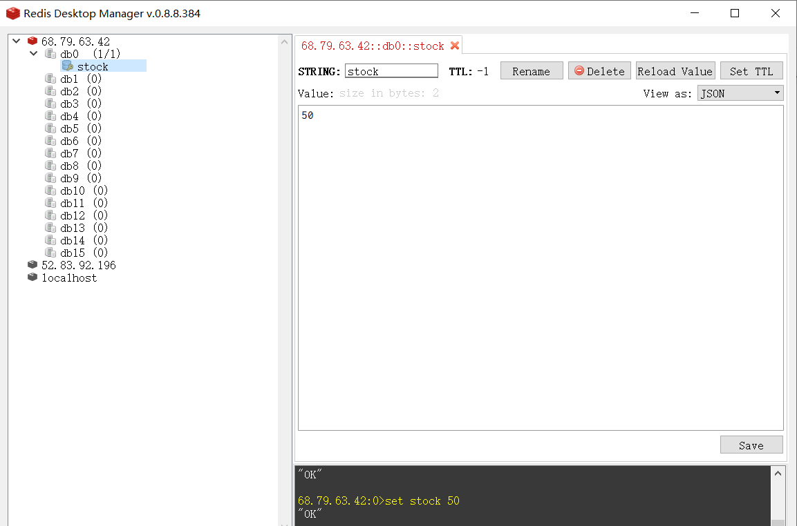

# 集信达【短信平台】短信发送服务

## 1. 短信发送服务介绍

短信发送服务的作用就是从消息缓冲区获取消息并和具体的短信通道(例如：阿里云短信、梦网短信、乐信短信等)对接来发送短信。

集信达短信平台整体架构：

  

- 发送短信：实时发送、定时发送
- 通道降级：通道发送失败，选择下一通道发送短信
- 通道选举：同一通道多次发送失败，降级通道
- 服务注册：有且只有一台机器执行通道选举

## 2. Redis实现分布式锁

对于简单的单体项目，即运行时程序在同一个Java虚拟机中，使用Java的锁机制（synchronized或者ReentrantLock）可以解决多线程并发问题。

可以运行`资料/redis-lock-demo`来重现线程并发问题。

测试过程：

第一步：启动redis-lock-demo服务

第二步：设置redis中库存stock值为50



第三步：使用apache jmeter进行压力测试


`注：Apache JMeter是Apache组织开发的基于Java的压力测试工具。用于对软件做压力测试，它最初被设计用于Web应用测试，但后来扩展到其他测试领域。`

可以发现对于单实例的应用来说，使用Java锁机制就可以解决线程并发问题。

但是在分布式环境中，程序是集群方式部署，如下图：


可以通过启动两个服务实例来测试集群部署时线程并发问题，具体测试步骤如下：

第一步：分别启动两个redis-lock-demo服务实例，端口号分别为8001和8002

第二步：配置Nginx负载均衡，通过Nginx将压力分发到两个实例上

~~~properties
upstream upstream_name{
	server 127.0.0.1:8001;
	server 127.0.0.1:8002;
}

server {
    listen       8080;
    server_name  localhost;

    location / {
        proxy_pass http://upstream_name;
        proxy_set_header Host $host;
        proxy_set_header X-Real-IP $remote_addr;
        proxy_set_header X-Forwarded-For $proxy_add_x_forwarded_for;
    }
}
~~~

第三步：使用Apache jmeter进行压力测试

可以发现对于集群环境下的多个服务实例又产生了线程并发问题。

上面的集群部署方式依然会产生线程并发问题，因为synchronized、ReentrantLock只是jvm级别的加锁，没有办法控制其他jvm。也就是上面两个tomcat实例还是可以出现并发执行的情况。要解决分布式环境下的并发问题，则必须使用分布式锁。

分布式锁可以理解为：控制分布式系统有序的去对共享资源进行操作，通过互斥来保证数据的一致性。

分布式锁，是控制分布式系统之间同步访问共享资源的一种方式。如果不同的系统或是同一个系统的不同主机之间共享了一个或一组资源，那么访问这些资源的时候，往往需要互斥来防止彼此干扰来保证一致性，在这种情况下，便需要使用到分布式锁。

实现分布式锁的方式很多，例如：Redis、数据库、Zookeeper等。

本小节主要讲Redis实现分布式锁的方式。

### 2.1 SETNX

这种加锁的思路是，如果 key 不存在则为 key 设置 value，如果 key 已存在则 SETNX 命令不做任何操作

- 客户端A请求服务器设置key的值，如果设置成功就表示加锁成功
- 客户端B也去请求服务器设置key的值，如果返回失败，那么就代表加锁失败
- 客户端A执行代码完成，删除锁
- 客户端B在等待一段时间后再去请求设置key的值，设置成功
- 客户端B执行代码完成，删除锁

**格式**：

```ruby
#尝试获取锁
127.0.0.1:6379> SETNX key value
#设置锁过期时间
127.0.0.1:6379> EXPIRE key seconds
#删除锁
127.0.0.1:6379> DEL key
```

为什么要设置key过期时间呢？

如果某个客户端获得锁后因为某些原因意外退出了，导致创建了锁但是没有来得及删除锁，那么这个锁将一直存在，后面所有的客户端都无法再获得锁，所以必须要设置过期时间。

### 2.2 SET

通过前面的expire命令来设置锁过期时间还存在一个问题，就是SETNX和EXPIRE两个命令不是原子性操作。在极端情况下可能会出现获取锁后还没来得及设置过期时间程序就挂掉了，这样就又出现了锁一直存在，后面所有的客户端都无法再获得锁的问题。

如何解决这个问题？答案是使用SET命令。

SET 命令从Redis 2.6.12 版本开始包含设置过期时间的功能，这样获取锁和设置过期时间就是一个原子操作了。

**格式**：

```ruby
SET key value [EX seconds] [NX]
```

**示例**：

```ruby
127.0.0.1:6379> SET mykey myvalue EX 5 NX
```

- EX seconds ：将键的过期时间设置为 seconds 秒
- NX ：只在key不存在时才对键进行设置操作

### 2.3 代码实现

基于redis实现分布式锁：

~~~java
package com.itheima.lock;

import org.springframework.data.redis.connection.RedisConnection;
import org.springframework.data.redis.connection.RedisConnectionFactory;
import org.springframework.data.redis.connection.RedisStringCommands;
import org.springframework.data.redis.connection.ReturnType;
import org.springframework.data.redis.core.RedisConnectionUtils;
import org.springframework.data.redis.core.RedisTemplate;
import org.springframework.data.redis.core.types.Expiration;
import org.springframework.stereotype.Repository;
import java.nio.charset.Charset;
import java.util.UUID;
import java.util.concurrent.TimeUnit;

/**
 * 基于redis实现分布式锁
 */
@Repository
public class RedisLock {

    /**
     * 解锁脚本，原子操作
     */
    private static final String unlockScript =
            "if redis.call(\"get\",KEYS[1]) == ARGV[1]\n"
                    + "then\n"
                    + "    return redis.call(\"del\",KEYS[1])\n"
                    + "else\n"
                    + "    return 0\n"
                    + "end";

    private RedisTemplate redisTemplate;

    public RedisLock(RedisTemplate redisTemplate) {
        this.redisTemplate = redisTemplate;
    }

    /**
     * 加锁，有阻塞
     *
     * @param name
     * @param expire
     * @param timeout
     * @return
     */
    public String lock(String name, long expire, long timeout) {
        long startTime = System.currentTimeMillis();
        String token;
        do {
            token = tryLock(name, expire);
            if (token == null) {
                if ((System.currentTimeMillis() - startTime) > (timeout - 50))
                    break;
                try {
                    Thread.sleep(50); //try 50 per sec
                } catch (InterruptedException e) {
                    e.printStackTrace();
                    return null;
                }
            }
        } while (token == null);

        return token;
    }

    /**
     * 加锁，无阻塞
     *
     * @param name
     * @param expire
     * @return
     */
    public String tryLock(String name, long expire) {
        name = name + "_lock";
        String token = UUID.randomUUID().toString();
        RedisConnectionFactory factory = redisTemplate.getConnectionFactory();
        RedisConnection conn = factory.getConnection();
        try {

            //参考redis命令：
            //set key value [EX seconds] [PX milliseconds] [NX|XX]
            Boolean result = conn.set(
                    name.getBytes(Charset.forName("UTF-8")),
                    token.getBytes(Charset.forName("UTF-8")),
                    Expiration.from(expire, TimeUnit.MILLISECONDS),
                    RedisStringCommands.SetOption.SET_IF_ABSENT //NX
            );
            if (result != null && result)
                return token;
        } finally {
            RedisConnectionUtils.releaseConnection(conn, factory,false);
        }
        return null;
    }

    /**
     * 解锁
     *
     * @param name
     * @param token
     * @return
     */
    public boolean unlock(String name, String token) {
        name = name + "_lock";
        byte[][] keysAndArgs = new byte[2][];
        keysAndArgs[0] = name.getBytes(Charset.forName("UTF-8"));
        keysAndArgs[1] = token.getBytes(Charset.forName("UTF-8"));
        RedisConnectionFactory factory = redisTemplate.getConnectionFactory();
        RedisConnection conn = factory.getConnection();
        try {
            Long result = (Long) conn.scriptingCommands().eval(unlockScript.getBytes(Charset.forName("UTF-8")), ReturnType.INTEGER, 1, keysAndArgs);
            if (result != null && result > 0)
                return true;
        } finally {
            RedisConnectionUtils.releaseConnection(conn, factory,false);
        }

        return false;
    }
}
~~~

## 3. Spring Task定时任务

### 3.1 Spring Task介绍

在企业软件开发中经常会遇到定时任务处理的业务场景，例如银行系统每晚会定时执行对账业务，很多系统每晚都会定时执行数据备份等等。

定时任务的实现方案有很多，例如：Quartz、Spring Task、XXL job等。对于简单的应用场景可以使用Spring Task。Spring Task相关API在spring-context包中已经提供了，不需要额外导入其他jar包。

### 3.2 代码案例

在Spring Boot项目中使用Spring Task非常简单，只需要在Bean的方法上加入@Scheduled注解，并通过cron表达式指定触发的时间即可。

第一步：在启动类上加入EnableScheduling注解

第二步：编写定时任务类

~~~java
package com.itheima.sms.job;

import org.springframework.scheduling.annotation.Scheduled;
import org.springframework.stereotype.Component;
import java.util.Date;

/**
 * Spring Task定时任务
 */
@Component
public class MyJob {

    /**
     * 每分钟检查一次是否有定时短信需要发送
     * @throws InterruptedException
     */
    @Scheduled(cron = "0/5 * * * * ?")     //指定触发时间
    public void sendTimingSms() throws InterruptedException {
        System.out.println("Spring Task定时任务，触发时间:" + new Date());
    }
}
~~~

## 4. 短信发送服务

### 4.1 需求分析

**功能需求：**

- 和具体的短信通道对接（例如：阿里云短信、梦网短信等），发送短信
- 短信定时发送
- 短信实时发送
- 服务注册，保证短信发送服务高可用
- 通道自动选举、降级

**处理过程：**

 

### 4.2 项目结构


### 4.3 核心代码

短信发送服务核心类：

- ServerRegister：服务注册器，用于将短信发送服务注册到Redis中，定时服务上报，定时服务检查
- ConfigServiceImpl：通道配置器，用于查询可用通道（阿里短信、华为短信等），通道选举、降级
- AbstractSmsService：短信发送器抽象父类，子类需要和具体的短信通道对接来完成发送短信的工作
- SmsConnectLoader：通道实例加载器，根据通道配置，初始化每个通道的Bean对象
- SmsFactory：短信发送工厂，获取具体的通道实例Bean对象（例如AliyunSmsService）来发送短信， 如果发送出现异常，触发通道选举和通道降级策略
- SendTimingSmsImpl：定时短信业务处理器，具体负责定时短信的发送
- SendSmsJob：短信发送定时任务，用于定时短信的发送，调用SendTimingSmsImpl发送定时短信
- GeneralSmsListener、HighSmsListener：短信接收器，Redis队列的消费者，监听队列中的消息，如果有消息则调用SmsFactory发送实时短信
- HighServerReceiver：通道消息监听器，通过Redis的发布订阅模式监听通道相关消息，调用SmsConnectLoader初始化通道和更新通道
- SubscriberConfig：订阅发布模式的容器配置，创建消息监听容器，并将HighServerReceiver加入容器中

### 4.4 功能实现

#### 4.4.1 服务注册器

服务注册器对应的为ServerRegister类。

短信发送服务支持分布式集群部署，可以是多个实例，实例越多，发送短信的能力越强。但是对于通道选举、持久化通道等操作，只能有一个服务实例执行，其他服务实例通过redis的广播机制获得通道变化。

如果要实现这一功能，需要将所有短信发送服务实例注册到某个地方，当前实现是将所有服务实例注册到Redis中。并且为了能够监控每个服务实例运行状态，需要每个服务实例定时上报并且定时进行服务检查。

**业务逻辑：**

1、服务注册，项目启动时将当前服务实例id注册到redis

2、服务上报，每三分钟报告一次，并传入当前时间戳

3、服务检查，每十分钟检查一次服务列表，清空超过五分钟没有报告的服务

**代码实现：**

~~~java
package com.itheima.sms.factory;

import lombok.extern.slf4j.Slf4j;
import org.springframework.beans.factory.annotation.Autowired;
import org.springframework.boot.CommandLineRunner;
import org.springframework.core.annotation.Order;
import org.springframework.data.redis.core.RedisTemplate;
import org.springframework.scheduling.annotation.Scheduled;
import org.springframework.stereotype.Component;
import java.util.ArrayList;
import java.util.List;
import java.util.Map;
import java.util.UUID;

/**
 * 服务注册器，将短信发送服务注册到Redis中，定时服务上报，定时服务检查
 */
@Component
@Slf4j
@Order(value = 100)
public class ServerRegister implements CommandLineRunner {
    //当前服务实例的唯一标识，可以使用UUID随机生成
    public static String SERVER_ID = null;

    @Autowired
    private RedisTemplate redisTemplate;

    /**
     * 项目启动时自动执行此方法，将当前服务实例注册到redis
     * @param args
     */
    @Override
    public void run(String... args) {
        //TODO 服务注册器，项目启动时将当前服务id注册到Redis中，使用Redis的Hash结构，key为SERVER_ID_HASH，Hash结构的key为服务id，value为时间戳

        // 生成服务id
        SERVER_ID = UUID.randomUUID().toString();
        log.info("生成服务id:{}", SERVER_ID);
        // 注册服务id
        redisTemplate.opsForHash().put("SERVER_ID_HASH", SERVER_ID, System.currentTimeMillis());
    }

    /**
     * 定时服务报告
     * 报告服务信息证明服务存在 每三分钟报告一次，并传入当前时间戳
     */
    @Scheduled(cron = "1 0/3 * * * ?")
    public void serverReport() {
        //TODO 服务注册器，每三分钟报告一次，并传入当前时间戳

        log.info("定时服务报告:{}", SERVER_ID);
        // 报告服务注册信息
        redisTemplate.opsForHash().put("SERVER_ID_HASH", SERVER_ID, System.currentTimeMillis());
    }

    /**
     * 定时服务检查
     * 每十分钟检查一次服务列表，清空超过五分钟没有报告的服务
     */
    @Scheduled(cron = "30 0/10 * * * ?")
    public void checkServer() {
        //TODO 服务注册器，定时服务检查，每十分钟检查一次服务列表，清空超过五分钟没有报告的服务

        log.info("服务检查任务:{}", SERVER_ID);
        // 报告服务注册信息
        Map map = redisTemplate.opsForHash().entries("SERVER_ID_HASH");
        log.info("服务检查：{}", map);
        Long current = System.currentTimeMillis();
        List removeKeys = new ArrayList();

        map.forEach((key, value) -> {
            long valueLong = Long.parseLong(value.toString());
            if (current - valueLong > (1000 * 60 * 5)) {
                // 已经超过五分钟没有报告
                removeKeys.add(key);
            }
        });

        log.info("服务检查 失效服务：{}", removeKeys);

        removeKeys.forEach(key -> {
            redisTemplate.opsForHash().delete("SERVER_ID_HASH", key);
        });
    }
}
~~~

可以启动两个服务实例来测试服务注册、服务上报、服务检查是否能够正常执行。

#### 4.4.2 通道实例加载器

通道实例加载器对应的为SmsConnectLoader类。

短信发送服务存在多个通道（例如阿里云短信、梦网短信等），这些通道是通过后台管理系统设置的，包括通道的名称、签名、模板、连接方式等信息。当短信发送服务启动时，或者后台管理系统设置通道时，将会初始化短信通道。


通道实例加载器的作用就是根据通道配置，初始化每个通道的Bean对象（例如AliyunSmsService、MengWangSmsService等）。

SmsConnectLoader类中只需要实现initConnect方法即可，其他方法已经提供好。

**业务逻辑：**

1、查询数据库获得通道列表

2、遍历通道列表，通过反射创建每个通道的Bean对象（例如AliyunSmsService、MengWangSmsService等）

3、将每个通道的Bean对象保存到CONNECT_LIST集合中

**具体代码如下：**

~~~java
/**
* 根据通道配置，初始化每个通道的bean对象
*/
@SneakyThrows
public void initConnect() {
    //TODO 根据通道配置，初始化每个通道的bean对象

    //获得通道列表
    List<ConfigEntity> configs = configService.listForConnect();
    List<Object> connectList = new ArrayList<>();
    //遍历通道列表
    for (ConfigEntity config : configs) {
        try {
            //通道配置
            SmsConfig smsConfig = new SmsConfig();
            smsConfig.setId(config.getId());
            smsConfig.setDomain(config.getDomain().trim());
            smsConfig.setName(config.getName().trim());
            smsConfig.setPlatform(config.getPlatform().trim());
            smsConfig.setAccessKeyId(config.getAccessKeyId().trim());
            smsConfig.setAccessKeySecret(config.getAccessKeySecret().trim());
            if (StringUtils.isNotBlank(config.getOther())) {
                LinkedHashMap linkedHashMap = JSON.parseObject(config.getOther(), LinkedHashMap.class);
                smsConfig.setOtherConfig(linkedHashMap);
            }
            //如：com.itheima.pinda.sms.AliyunSmsService
            //也就是说当定义新的通道时，类的名称需要以SmsService结尾，通道名称需要保存在数据库中
            Class cls = Class.forName("com.itheima.sms.sms." + config.getPlatform() + "SmsService");

            Constructor<?> cons = cls.getConstructor(SmsConfig.class);
            Object object = cons.newInstance(smsConfig);
            //签名
            Field signatureServiceField = cls.getSuperclass().getDeclaredField("signatureService");

            //模板
            Field templateServiceField = cls.getSuperclass().getDeclaredField("templateService");

            signatureServiceField.setAccessible(true);
            templateServiceField.setAccessible(true);
            signatureServiceField.set(object, SpringUtils.getBean(SignatureServiceImpl.class));
            templateServiceField.set(object, SpringUtils.getBean(TemplateServiceImpl.class));

            connectList.add(object);
            log.info("通道初始化成功：{} {}", config.getName(), config.getPlatform());
        } catch (Exception e) {
            log.warn("通道初始化失败：{}", e.getMessage());
        }
    }

    //重新赋值通道列表
    if(!CONNECT_LIST.isEmpty()){
            CONNECT_LIST.clear();
    }
    CONNECT_LIST.addAll(beanList);

    //解锁
    if (StringUtils.isNotBlank(BUILD_NEW_CONNECT_TOKEN)) {
        redisLock.unlock("buildNewConnect", BUILD_NEW_CONNECT_TOKEN);
    }
    log.info("通道初始化完成:{}", CONNECT_LIST);
}
~~~

#### 4.4.3 定时短信业务处理器

定时短信业务处理器对应的是SendTimingSmsImpl类，具体负责定时短信的发送。

**业务逻辑：**

1、查询数据库获取本次需要发送的定时短信

2、调用短信工厂发送短信

3、更新短信发送状态为“已处理”

**实现代码：**

~~~java
package com.itheima.sms.job;

import com.baomidou.mybatisplus.core.conditions.query.LambdaQueryWrapper;
import com.itheima.sms.entity.TimingPushEntity;
import com.itheima.sms.factory.SmsFactory;
import com.itheima.sms.mapper.TimingPushMapper;
import lombok.extern.slf4j.Slf4j;
import org.springframework.beans.factory.annotation.Autowired;
import org.springframework.scheduling.annotation.Async;
import org.springframework.stereotype.Component;
import java.util.List;

/**
 * 定时短信业务处理器
 */
@Component
@Slf4j
public class SendTimingSmsImpl implements SendTimingSms {

    @Autowired
    private TimingPushMapper timingPushMapper;

    @Autowired
    private SmsFactory smsFactory;//短信发送工厂

    /**
     * 发送定时短信
     * @param timing
     */
    @Override
    @Async
    public void execute(String timing) {
        //TODO 查询数据库获取本次需要发送的定时短信，调用短信工厂发送短信

        log.info("任务开始执行" + timing);
        
        //查找需要发送的短信
        LambdaQueryWrapper<TimingPushEntity> wrapper = new LambdaQueryWrapper<>();
        wrapper.eq(TimingPushEntity::getStatus, 0);
        wrapper.eq(TimingPushEntity::getTiming, timing);
        wrapper.orderByAsc(TimingPushEntity::getCreateTime, TimingPushEntity::getId);
        
        List<TimingPushEntity> timingPushList = timingPushMapper.selectList(wrapper);
        log.info("本次定时任务需处理条数:{}", timingPushList.size());
        
        timingPushList.forEach(timingPushEntity -> {
            String deserialize = timingPushEntity.getRequest();
            log.info("定时发送短信:{}", deserialize);
            //发送短信
            smsFactory.send(deserialize);
            timingPushEntity.setStatus(1);
            timingPushMapper.updateById(timingPushEntity);
        });

        log.info("任务执行完毕" + timing);
    }
}
~~~

#### 4.4.4 短信发送定时任务

短信发送定时任务对应的是SendSmsJob类，用于定时短信的发送，调用SendTimingSmsImpl发送定时短信。

**业务逻辑：**

1、每分钟触发一次定时任务

2、为了防止短信重复发送，需要使用分布式锁

3、调用SendTimingSmsImpl发送定时短信

**代码实现：**

~~~java
package com.itheima.sms.job;

import com.itheima.sms.config.RedisLock;
import com.itheima.pinda.utils.DateUtils;
import lombok.extern.slf4j.Slf4j;
import org.apache.commons.lang3.StringUtils;
import org.springframework.beans.factory.annotation.Autowired;
import org.springframework.scheduling.annotation.Scheduled;
import org.springframework.stereotype.Component;
import java.util.Date;

/**
 * 定时任务，用于发送定时短信
 */
@Component
@Slf4j
public class SendSmsJob {

    @Autowired
    private SendTimingSms sendTimingSms;

    @Autowired
    private RedisLock redisLock;

   	/**
     * 每分钟检查一次是否有定时短信需要发送
     * @throws InterruptedException
     */
    //1、每分钟触发一次定时任务
    @Scheduled(cron = "10 0/1 * * * ?")     //每分钟的第10秒执行一次
    public void sendTimingSms() throws InterruptedException {
        //TODO 定时任务，每分钟检查一次是否有定时短信需要发送

        //2、为了防止短信重复发送，需要使用分布式锁
        String token = redisLock.tryLock("SEND_TIMING_SMS",1000 * 30);
        
        if(StringUtils.isNotBlank(token)){
            log.info("准备执行定时发送短信任务");
            //当前实例抢到锁，可以执行定时短信的发送
            //3、调用SendTimingSmsImpl发送定时短信
            sendTimingSms.execute(DateUtils.format(new Date(),"yyyy-MM-dd HH:mm"));
        }
    }
}
~~~

#### 4.4.5 短信接收器

应用系统调用短信接收服务，短信接收服务将短信消息放入消息队列，实现短信的接收和发送的解耦，这种方案可以最大化提高短信接收服务性能，不会由于外部短信通道影响应用系统的响应，从而起到削峰填谷的效果。

本系统使用的Redis集群作为消息队列，在传输短信时，采用的是生产者消费者模式。

短信接收器对应的类为GeneralSmsListener和HighSmsListener，角色是Redis队列的消费者，监听队列中的消息，如果有消息则调用SmsFactory发送实时短信。

**业务逻辑：**

1、HighSmsListener监听TOPIC_HIGH_SMS队列，如果有消息则调用短信发送工厂SmsFactory发送实时短信

2、GeneralSmsListener监听TOPIC_GENERAL_SMS队列，如果有消息则调用短信发送工厂SmsFactory发送实时短信

**HighSmsListener具体实现：**

~~~java
package com.itheima.sms.redismq;

import com.itheima.sms.factory.SmsFactory;
import lombok.extern.slf4j.Slf4j;
import org.springframework.beans.factory.annotation.Autowired;
import org.springframework.beans.factory.annotation.Value;
import org.springframework.data.redis.core.ListOperations;
import org.springframework.data.redis.core.RedisTemplate;
import org.springframework.stereotype.Component;
import javax.annotation.PostConstruct;
import java.util.Date;
import java.util.concurrent.TimeUnit;

/**
 * Redis队列-----消费者
 * 监听消息队列：TOPIC_HIGH_SMS，高优先级的短信，如验证码之类的短信
 */
@Component
@Slf4j
public class HighSmsListener extends Thread {
    @Autowired
    private RedisTemplate redisTemplate;

    @Autowired
    private SmsFactory smsFactory;

    private String queueKey = "TOPIC_HIGH_SMS";

    @Value("${spring.redis.queue.pop.timeout}")
    private Long popTimeout = 8000L;

    private ListOperations listOps;

    @PostConstruct
    private void init() {
        listOps = redisTemplate.opsForList();
        this.start();
    }

    @Override
    public void run() {
        //TODO 监听TOPIC_HIGH_SMS队列，如果有消息则调用短信发送工厂发送实时短信

        while (true) {
            log.debug("{} 监听中", queueKey);
            String message = (String) listOps.rightPop(queueKey, popTimeout, TimeUnit.MILLISECONDS);
            if (null != message) {
                log.info("{} 收到消息:{}", queueKey, message);
                smsFactory.send(message);
            }
        }
    }
}
~~~

**GeneralSmsListener具体实现：**

~~~java
package com.itheima.sms.redismq;

import com.itheima.sms.factory.SmsFactory;
import lombok.extern.slf4j.Slf4j;
import org.springframework.beans.factory.annotation.Autowired;
import org.springframework.beans.factory.annotation.Value;
import org.springframework.data.redis.core.ListOperations;
import org.springframework.data.redis.core.RedisTemplate;
import org.springframework.stereotype.Component;
import javax.annotation.PostConstruct;
import java.util.concurrent.TimeUnit;

/**
 * Redis队列消费者，监听消息队列TOPIC_GENERAL_SMS，普通优先级的短信，如营销短信
 */
@Component
@Slf4j
public class GeneralSmsListener extends Thread {
    @Autowired
    private RedisTemplate redisTemplate;

    @Autowired
    private SmsFactory smsFactory;

    private String queueKey = "TOPIC_GENERAL_SMS";

    @Value("${spring.redis.queue.pop.timeout}")
    private Long popTimeout = 8000L;

    private ListOperations listOps;

    @PostConstruct
    private void init() {
        listOps = redisTemplate.opsForList();
        this.start();
    }

    @Override
    public void run() {
        //TODO 监听TOPIC_GENERAL_SMS队列，如果有消息则调用短信发送工厂发送实时短信

        while (true) {
            log.debug("{} 监听中", queueKey);
            String message = (String) listOps.rightPop(queueKey, popTimeout, TimeUnit.MILLISECONDS);
            if (null != message) {
                log.info("{} 收到消息" + message);
                //发送短信
                smsFactory.send(message);
            }
        }
    }
}
~~~

#### 4.4.6 通道消息监听器

通道消息监听器对应的类是HighServerReceiver，作用是通过Redis的发布订阅模式监听TOPIC_HIGH_SERVER频道中的消息，调用SmsConnectLoader初始化通道和更新通道。

**业务逻辑：**

1、通过Redis发布订阅模式监听TOPIC_HIGH_SERVER频道中的消息

2、如果消息为USE_NEW_CONNECT，表示通道更新，调用通道实例加载器SmsConnectLoader更新通道

3、如果消息为INIT_CONNECT，表示通道初始化，调用通道实例加载器SmsConnectLoader初始化通道

**实现代码：**

~~~java
package com.itheima.sms.redismq;

import com.itheima.sms.factory.SmsConnectLoader;
import com.itheima.sms.model.ServerTopic;
import lombok.extern.slf4j.Slf4j;
import org.springframework.beans.factory.annotation.Autowired;
import org.springframework.data.redis.connection.Message;
import org.springframework.data.redis.connection.MessageListener;
import org.springframework.data.redis.core.RedisTemplate;
import org.springframework.data.redis.serializer.RedisSerializer;
import org.springframework.stereotype.Component;

/**
 * Redis发布订阅----订阅者，通过Redis的发布订阅模式监听TOPIC_HIGH_SERVER频道
 */
@Component
@Slf4j
public class HighServerReceiver implements MessageListener {

    @Autowired
    private RedisTemplate redisTemplate;

    @Autowired
    private SmsConnectLoader smsConnectLoader;

    /**
     * 消息监听
     * @param message
     * @param pattern
     */
    @Override
    public void onMessage(Message message, byte[] pattern) {
        //TODO 消息监听，根据消息内容调用smsConnectLoader进行通道初始化或者通道更新

        RedisSerializer<?> valueSerializer = redisTemplate.getDefaultSerializer();
        String deserialize = valueSerializer.deserialize(message.getBody()).toString();
        
        ServerTopic serverTopic = ServerTopic.load(deserialize);

        switch (serverTopic.getOption()) {
            case ServerTopic.USE_NEW_CONNECT:
                log.info("服务：{} 发起【通道更新】", serverTopic.getValue());
                smsConnectLoader.changeNewConnect();
                break;
            case ServerTopic.INIT_CONNECT:
                log.info("服务：{} 发起【通道初始化】", serverTopic.getValue());
                smsConnectLoader.initConnect();
                break;
            default:
                break;
        }

    }
}
~~~


